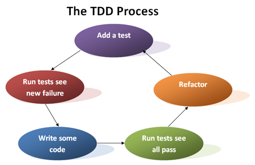

### Testes e Qualidade de Software

A <b>Qualidade de Software</b> está associada a quantidade de falhas percebidas no software sendo que, quanto menos falhas mais qualidade há.

Os <b>Testes</b> servem para testar a qualidade, ou seja, buscar falhas no software para que sejam corrigidas aumentando assim a qualidade do mesmo. Podem ser:
<ol>
  <li>
    <b>Teste de de Unidade: Função, Método, ou Classe</b> 
    <ul>
      <li>Não se preocupa com o sistema como um todo, mas sim em partes.</li> 
      <li><b>Isola</b> a parte a ser testada de dependências esternas (APIs e Banco de Dados).</li>
      <li><b>Automatização</b> para rodar testes frequentemente, como em cada commit, por exemplo.</li>
      <li>
        <b>Modos de Testar:</b>
        
Manual - Inspeção de Código

        
Automático - Asserção com frameworks de testes

      </li>
      <li>
        

          <b>Abordagens de Testes Automáticos:</b>
          
<b>TDD (Testing-Driven Development) - Desenvolvimento Dirigido po Testes</b>

          
          <code>Add Teste &rarr; Testar e Falhar &rarr; Escrever Código Válido &rarr; Testar e Passar &rarr; Refatorar &rarr; Volta para Início</code>  
          <b>Escrevita de código válido:</b> Baby Steps, apenas o necessário para que o teste passe 
          <b>Principal vantagem:</b> Código nasce testado e a garantia de uma regressão, testar novamente o que já foi testado assim evitando que uma nova feature quebre uma anterior e a faça ir para produção despercebidamente.
          

            <h4>Sistema Calculadora - TDD</h4>
            
Jordan é um programador freelancer e precisa desenvolver uma Calculadora para um cliente. O cliente definiu que a Calculadora deveria realizar operações como: <b>soma, subtração, divisão, multiplicação, potenciação e raiz.</b> Um total de 6 operações.

            
Jordan quer entregar o sistema bem feito e funcionando corretamente, e para que isso seja garantido ele escolheu a abordagem de TDD (Testing-Driven Development) para que o código venha ao mundo já testado.

            

            Para isso, ele sabe que a <b>sequência de desenvolvimento</b> será:
             
            1 - Criar um primeiro teste para uma das operações da Calculadora;
             
            2 - Quando criar o primeiro teste, rodar este teste, mesmo sem a implementação estar pronta;
             
            3 - O teste VAI dar errado, mas nesse momento deve escrever um código válido, que faça com que este teste passe;
             
            4 - Rodar novamente o teste e verificar se o que foi implementado foi sufieciente para que o teste funcionasse;
             
            5 - Refatorar/Melhorar/Implementar nova funcionalidade;
             
            6 - Reiniciar novamente o ciclo para uma nova funcionalidade;
            
No TDD, a sequência de desenvolvimento é um pouco custosa por pensar no teste antes

            

          

        

      </li>
    </ul>
  </li>
  <li><b>Integração: </b></li>
  <li><b>Sistema: </b></li>
  <li><b>Aceitação: </b></li>
</ol>